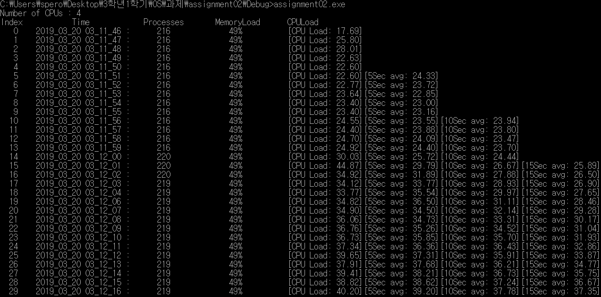

# simple-resource-monitor

> 매 초마다 현재의 프로세서의 수, 프로세스의 수, 메모리 Load, CPU Load(Multi Core Process라면 5초, 10초, 15초 마다의 평균 CPU Load 또한)를 출력하는 프로그램  

## Project Stack

* C++

## Project Result
실행 화면
</img>
